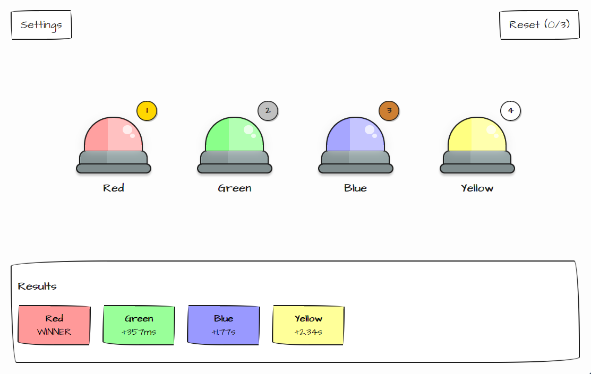
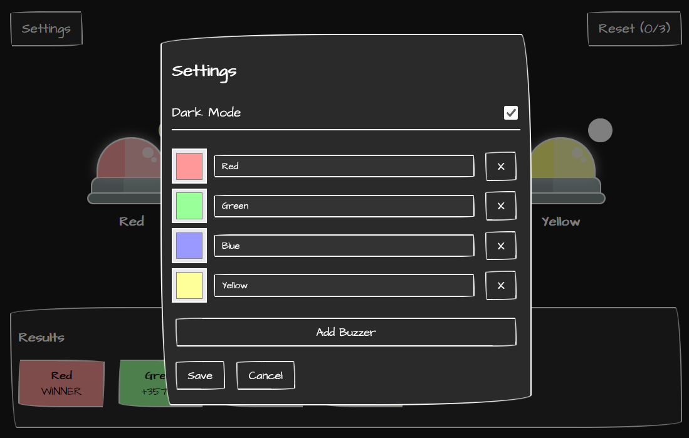

<p align="center">
	
</p>

<h1 align="center">Buzzy</h1>

> A lightweight, self-hosted buzzer for personal use. I use it as embed in private Excalidraw instance when we play quiz games.

<table align="center">
	<tr>
		<td align="center">
			<a href="frontend/public/screenshot.png">
				
			</a>
		</td>
		<td align="center">
			<a href="frontend/public/screenshot-dark.png">
				
			</a>
		</td>
	</tr>
</table>

## Features

- **Zero Setup** — No user registration, no accounts, no login walls
- **Single Session** — Fresh buzzer for every use, no persistent data to manage
- **Self-Hosted** — Run it on your own machine or server

- **Lightweight** — Minimal dependencies, fast and responsive

## Quick Start

### Installation
```bash
npm install
```

### Running Locally
```bash
npm start
```

The server starts on `http://localhost:3000` by default. That's it!

### Using as an Embed
Add this iframe to your Excalidraw or any webpage:
```html
<iframe src="http://your-server:3000" width="600" height="400"></iframe>
```

## How It Works

- **Frontend**: Simple HTML/CSS/JS interface for triggering buzzes
- **Backend**: Lightweight Node.js server with Server-Sent Events for real-time updates
- **Communication**: HTTP endpoints plus Server-Sent Events for instant buzz distribution

No database. No persistence. No fuss.

## Development

### Start Development Mode
```bash
just dev
```

### Linting
```bash
# Check for issues
npm run lint

# Auto-fix issues
npm run lint:fix
```

### Tests
```bash
just test
```

## Project Structure

```
buzzy/
├── src/
│   └── server.js          # Node.js backend server
├── frontend/
│   └── public/            # Static serve files
│       ├── index.html     # Main UI
│       ├── main-utils.js   # Shared frontend helpers
│       ├── main.js        # Frontend logic
│       └── main.css       # Styling
├── tests/                 # Node test suite
├── package.json
├── justfile               # Development automation
└── README.md
```

## Running Behind Docker
See `docker-compose.yaml` and `docker-compose.coolify.yaml` for containerized deployment.
